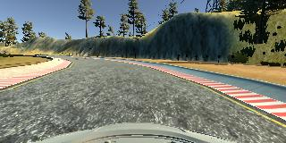
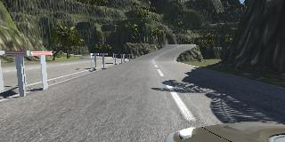
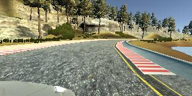

# **Behavioral Cloning (by Andrey Shitov)**
[](http://www.udacity.com/drive)
## Behavioral Cloning Project

The goals / steps of this project are the following:
* Use the simulator to collect data of good driving behavior
* Build, a convolution neural network in Keras that predicts steering angles from images
* Train and validate the model with a training and validation set
* Test that the model successfully drives around track one without leaving the road
* Summarize the results with a written report

Result videos:
* [Track 1](https://youtu.be/y2FZ-6DJTvg)
* [Track 2](https://youtu.be/JvrBCiJ-lvQ)
* [Training data](https://youtu.be/_9vuhSt-49s)

## Rubric Points
**Here I will consider the [rubric points](https://review.udacity.com/#!/rubrics/432/view) individually and describe how I addressed each point in my implementation.**

---
### Files Submitted & Code Quality

#### 1. Submission includes all required files and can be used to run the simulator in autonomous mode

My project includes the following files:
* model.py containing the script to create and train the model
* drive.py for driving the car in autonomous mode
* model.h5 containing a trained convolution neural network
* writeup_report.md summarizing the results
* track1.mp4 and track2.mp4 - videos, showing how models behave on test tracks
* track_training.mp4 - video created from training data (shows how I was driving in the simulator)

#### 2. Submission includes functional code
Using the Udacity provided simulator and my drive.py file, the car can be driven autonomously around the track by executing
```sh
python drive.py model.h5
```

#### 3. Submission code is usable and readable

The model.py file contains the code for training and saving the convolution neural network. The file shows the pipeline I used for training and validating the model, and it contains comments to explain how the code works.

### Model Architecture and Training Strategy

#### 1. An appropriate model architecture has been employed

I used the model, mentioned in learning materials, which was  [published](https://devblogs.nvidia.com/deep-learning-self-driving-cars/) by NVIDIA. Its structure is the following:


The model consists of a convolution neural network with 5x5 and 3x3 filter sizes and depths between 24 and 64 (model.py lines 69-80).

The model includes RELU layers to introduce nonlinearity, and the data is normalized in the model using a Keras lambda layer.

#### 2. Attempts to reduce overfitting in the model

The model contains dropout layer in order to reduce overfitting (model.py lines 73). (Actually I added it just to meet the project rubrics. The model worked good even without it. Probably, it wasn't overfitting because I trained the CNN only for 1 epoch)

The model was tested by running it through the simulator and ensuring that the vehicle could stay on the track.

#### 3. Model parameter tuning

The model used an Adam optimizer, so the learning rate was not tuned manually (model.py line 83).

#### 4. Appropriate training data

Training data was chosen to keep the vehicle driving on the road. I used center lane driving from the first and second tracks, also I added center lane driving in the opposite direction on the first track.

For details about how I created the training data, see the next section.

### Model Architecture and Training Strategy

#### 1. Solution Design Approach

The overall strategy for deriving a model architecture was  to follow instructions from the learning materials:

1. Used the code from section "8. Training Your Network" to create a dumb model. It could not go straight even a meter.
2. Added data preprocessing as mentioned in section "10. Data preprocessing". It allowed to normalize the data using a lambda layer.
3. Tried LeNet network as it described in section "11. More Networks". By the way, there is an error in LeNet implementation, which is shown in the video - line 34 on the 38th second of the video should be
```
model.add(Convolution2D(16,5,5,activation="relu"))
```
instead of
```
model.add(Convolution2D(6,5,5,activation="relu"))
```
4. I used data augmentation (flipping) from "12. Data Augmentation", data from multiple cameras technique as discussed in "13. Using Multiple Cameras" and cropping layer (see "14. Cropping Images in Keras"). After that, the car, driven by my model, was able to complete almost the whole track, except couple of last turns.

5. Switched to NVIDIA's network architecture, discussed in section "15. Even More Powerful Network". My model was able to drive the car successfully on the first track.

6. I implemented generator as described in section "18. Generators". After doing it, I noticed that model training happens differently depending on `batch_size` used inside the generator. With `batch_size` == 1 training goes faster, but final loss after one epoch is bigger comparing to training with larger `batch_size`. Actually I didn't understand why this happens, apparently, beacause of how `fit_generator` uses generator in its implementation. I noticed that for me training with `batch_size = 16` and training for 1 epoch allowed to drive correctly on both tracks, so I stuck to these parameters.

7. Added training data for second track. I succeeded testing my model on the second track from the first time. But when I came back to test it on the first track, I found that it comes too close to the road edge in some turns. So I also added training data for the first track going in the opposite direction. This also allowed to balance number of images from both tracks.

8. To combat the overfitting (to meet the rubrics :)), I modified the model so that I added a dropout layer. After that the vehicle started to fell off at one point on the second track. I tackled that by increasing number of training epochs from 1 to 3.

At the end of the process, the vehicle is able to drive autonomously around the both tracks without leaving the road.

#### 2. Creation of the Training Set & Training Process

Surprisingly, my approach for capturing data for training was straightforward. I captured the following data:

* One lap on first track using center lane driving
* One lap on second track using center lane driving
* One lap in opposite direction on first track using center lane driving

Here are examples image of captured pictures:





All collected data (center view) was combined into [video with training dataset](https://youtu.be/_9vuhSt-49s).
To augment the data set, I also flipped images and angles thinking that this would help my model for generalize.

After the collection process, I had 15333 number of data points, including images from left and right view. I preprocessed the data by converting it to RGB format, because by default images were loaded in BGR. I augmented this data by flipping it (as it was mentioned earlier). I also randomly shuffled the data set and put 20% of the data into a validation set.

I used this training data for training the model. The validation set helped determine if the model was over or under fitting. The ideal number of epochs was 1 without dropout layer and 3 with it. I used an Adam optimizer so that manually training the learning rate wasn't necessary.
